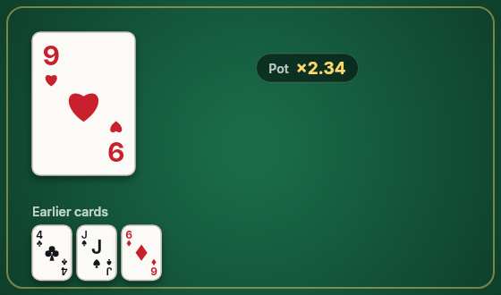
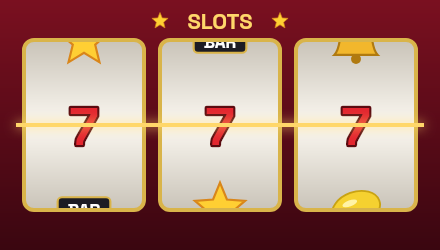
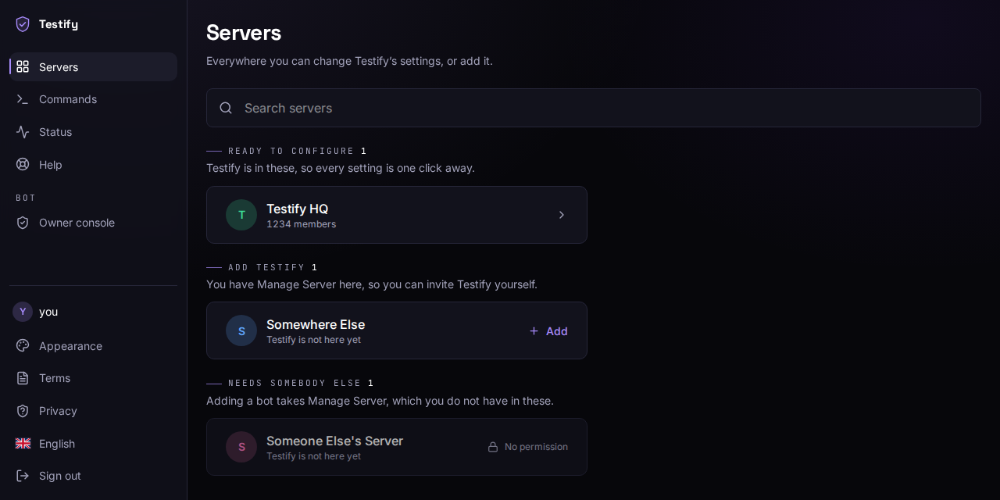
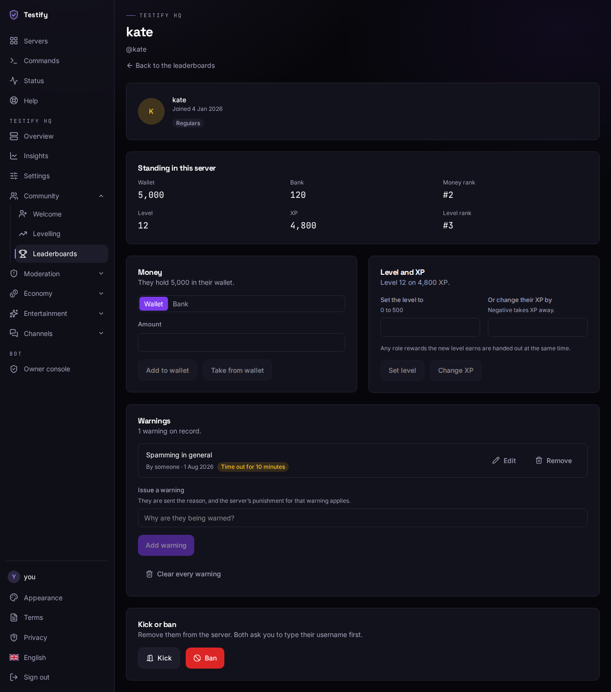
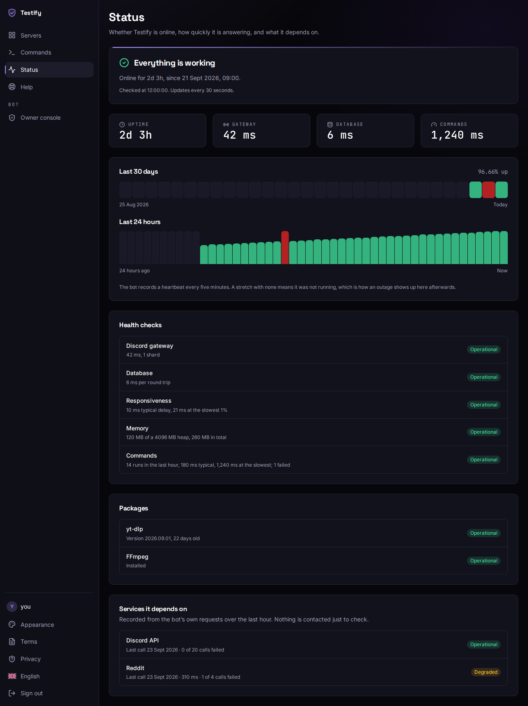
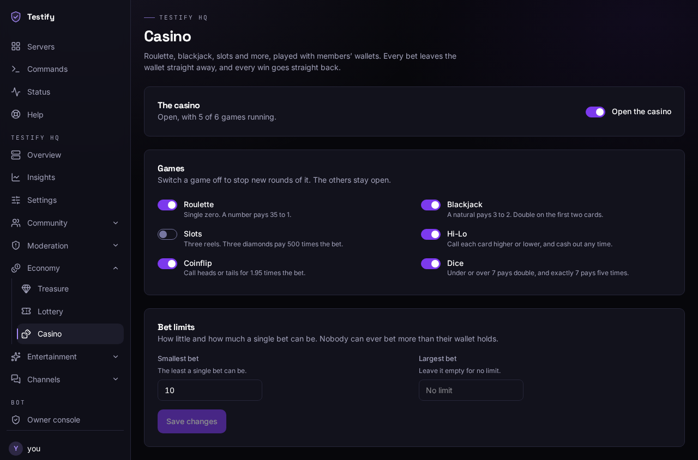
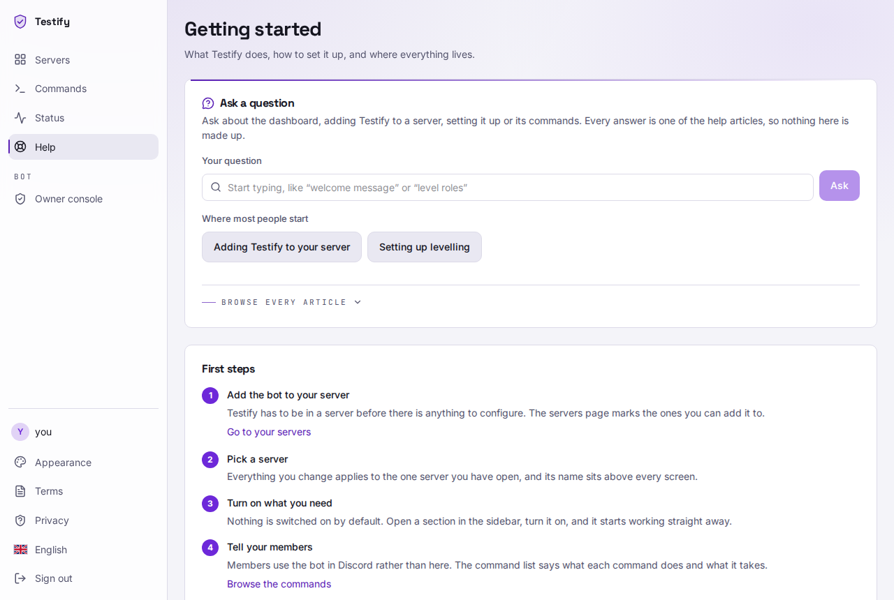
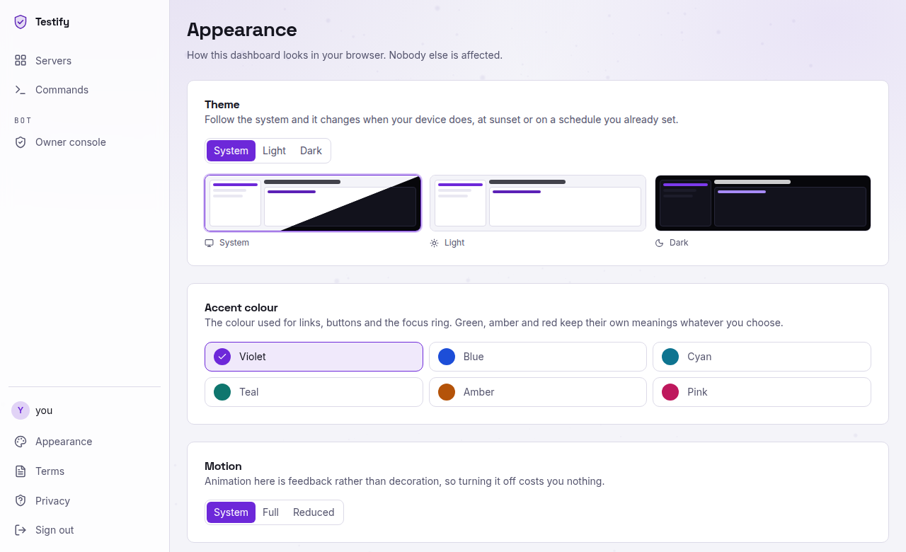

<!--     ████████╗███████╗███████╗████████╗██╗███████╗██╗   ██╗
         ╚══██╔══╝██╔════╝██╔════╝╚══██╔══╝██║██╔════╝╚██╗ ██╔╝
            ██║   █████╗  ███████╗   ██║   ██║█████╗   ╚████╔╝
            ██║   ██╔══╝  ╚════██║   ██║   ██║██╔══╝    ╚██╔╝
            ██║   ███████╗███████║   ██║   ██║██║        ██║
            ╚═╝   ╚══════╝╚══════╝   ╚═╝   ╚═╝╚═╝        ╚═╝    -->


<p align="center">
  <a href="https://github.com/Kkkermit/Testify/actions/workflows/ci.yml"></a>
  <a href="https://github.com/Kkkermit/Testify/actions/workflows/nightly.yml"></a>
  <a href="package.json"></a>
  <a href="LICENSE"></a>
</p>

<p align="center">
  <a href="https://www.typescriptlang.org"></a>
  <a href="https://discord.js.org"></a>
  <a href=".nvmrc"></a>
  <a href="https://www.mongodb.com"></a>
  <a href="AGENTS.md#17-testing"></a>
</p>

<p align="center">
  <a href="https://github.com/Kkkermit/Testify/stargazers"></a>
  <a href="https://github.com/Kkkermit/Testify/network/members"></a>
  <a href="https://github.com/Kkkermit/Testify/issues"></a>
  <a href="https://github.com/Kkkermit/Testify/graphs/contributors"></a>
  <a href="https://discord.gg/xcMVwAVjSD"></a>
</p>

<h3 align="center">An all-in-one Discord bot, written once for both slash <em>and</em> prefix commands.</h3>

<p align="center">
<strong>79 commands and 131 subcommands</strong> — moderation, economy, a casino, levelling, music, tickets, giveaways
and games — plus an optional web dashboard. Every command works as <code>/ban</code> <strong>and</strong> as
<code>t?ban</code>, because underneath it is one command, not two copies.
</p>

<p align="center">
  <a href="#-quick-start"><strong>Quick start</strong></a> ·
  <a href="#-features"><strong>Features</strong></a> ·
  <a href="#-see-it-in-discord"><strong>Screenshots</strong></a> ·
  <a href="#️-the-web-dashboard"><strong>Dashboard</strong></a> ·
  <a href="docs/README.md"><strong>Docs</strong></a> ·
  <a href="https://discord.gg/xcMVwAVjSD"><strong>Support</strong></a>
</p>

<p align="center">
  <a href="https://discord.com/oauth2/authorize?client_id=1211784897627168778&permissions=8&scope=applications.commands%20bot"></a>
  <a href="https://buymeacoffee.com/kkermit"></a>
</p>

> [!CAUTION]
> **Never share or commit your `.env` file or any of its values.** It holds your bot token and your MongoDB
> password — anyone who gets them controls your bot and your data. `.gitignore` already covers `.env*`. If a
> token ever reaches somewhere public, reset it immediately in the Developer Portal.

<details>
<summary><strong>📑 Table of contents</strong></summary>

- [✨ What's new in v2](#-whats-new-in-v2)
- [🧩 Features](#-features)
- [📸 See it in Discord](#-see-it-in-discord)
- [🏗️ How it fits together](#️-how-it-fits-together)
- [💻 Compatibility](#-compatibility)
- [🚀 Quick start](#-quick-start)
- [📖 Full setup guide](#-full-setup-guide)
- [🐳 Running it in Docker](#-running-it-in-docker)
- [⌨️ Slash and prefix](#️-slash-and-prefix)
- [🗂️ Command categories](#️-command-categories)
- [🛠️ Adding your own command](#️-adding-your-own-command)
- [🖥️ The web dashboard](#️-the-web-dashboard)
- [📜 Scripts](#-scripts)
- [❓ FAQ](#-faq)
- [🩺 Troubleshooting](#-troubleshooting)
- [📚 Documentation](#-documentation)
- [🤝 Contributing](#-contributing)
- [💛 Support](#-support)
- [⚖️ License](#️-license)

</details>

> [!TIP]
> ⭐ **If Testify is useful to you, or you have borrowed any of its code, please leave a star.** It genuinely helps,
> and it tells us the project is worth continuing.

---

## ✨ What's new in v2

v2 is a **complete rewrite of the original JavaScript bot in TypeScript** — not a port with types bolted on.
The whole thing was rebuilt around the problems the old codebase actually had.

|                    | v1 (JavaScript)                                                                        | v2 (TypeScript)                                                              |
| ------------------ | -------------------------------------------------------------------------------------- | ---------------------------------------------------------------------------- |
| **Slash + prefix** | Two separate implementations of each command, kept in sync by hand                     | **One command serves both.** 46 duplicated pairs became one file each        |
| **Types**          | None                                                                                   | `strict`, plus `noUncheckedIndexedAccess` and `exactOptionalPropertyTypes`   |
| **Config**         | Bot IDs and log channels hardcoded, so a fresh clone logged into someone else's server | Everything through a **validated `.env`** — no IDs committed to the repo     |
| **Start-up**       | Command registration raced the login                                                   | Each step awaited in order; a malformed file names itself and stops the boot |
| **Errors**         | Stack traces could reach chat                                                          | One error boundary — users get a plain apology, you get the full context     |
| **Money**          | Read-modify-save, so balances could duplicate under load                               | Atomic database updates                                                      |
| **Tests**          | A handful                                                                              | **Nearly 6,000 tests**, with an enforced 80% coverage floor                  |
| **Setup**          | Manual, including patching a file inside `node_modules`                                | `npm run setup`, and you are running                                         |
| **Web**            | None                                                                                   | An optional dashboard served from the bot itself                             |

Everything the old bot did is still here, apart from the integrations that needed paid or personal API keys
(Spotify, Valorant, Instagram and the AI commands).

## 🧩 Features

<table>
<tr>
<td width="50%" valign="top">

### 🛡️ Moderation

- **Ban, softban, kick, mute, lock, slowmode**, nicknames and roles
- **Warnings that escalate** — set what the 1st, 2nd and 3rd warning do: a timeout, a kick or a ban
- **AutoMod** — Discord's own filters for words, spam, mentions and links
- **Audit logging** — 18 event types, each switchable per server
- **Tickets** — panels, claiming, locking and HTML transcripts

</td>
<td width="50%" valign="top">

### 💰 Economy and levelling

- **Wallet and bank** — work, daily, beg, rob, heists and transfers
- **Shop, inventory and pets** that need feeding and walking
- **Lottery and treasure drops** run by the server
- **Leaderboards** by total, wallet or bank, for one server or every server
- **Levelling** — XP, role rewards, boost roles and drawn rank cards

</td>
</tr>
<tr>
<td valign="top">

### 🎰 Casino

- **Roulette** — a shared table anybody in the channel can bet on, on an animated single-zero wheel
- **Blackjack** and **hi-lo** dealt on drawn card tables
- **Slots** with spinning reels, plus **coinflip** and **dice**
- The stake leaves the wallet first, so a restart never swallows a bet
- Open it, close it, switch single games off and set bet limits per server

</td>
<td valign="top">

### 🎵 Music

- **YouTube and SoundCloud**, by link or by search, with autocomplete on `/play`
- **One live panel** — queue, loop, shuffle, skip, previous and a moving progress bar
- **Volume from 0 to 200%**, on the panel and on `/music volume`
- **DJ roles and a kill switch** per server
- Opus passes straight through where a source offers it, so most tracks are never transcoded

</td>
</tr>
<tr>
<td valign="top">

### 🎉 Community

- **Giveaways** that survive a restart
- **Welcome cards** drawn for every new member
- **Counting, sticky messages, auto roles and verification**
- **Voice-channel counters** and a self-updating bot statistics message

</td>
<td valign="top">

### 🧰 Everything else

- **Info** — users, servers, roles, avatars, banners and profiles
- **Games** — guess the number, guess the Pokémon, fast type, RPS, 8ball
- **`/ask`** — a help desk that answers from written articles, never generated text
- **Per-command switches**, per server or bot-wide, from Discord or the dashboard

</td>
</tr>
</table>

## 📸 See it in Discord

Every picture the bot sends is drawn on the fly with its bundled fonts, so it looks the same on every host. These
come from the bot's own renderers — `npm run docs:images` redraws them with invented members.

<table>
<tr>
<td width="50%" align="center"><br><sub><b>/rank</b> — level, rank, progress and any XP boost</sub></td>
<td width="50%" align="center"><br><sub><b>Welcome card</b> — sent when somebody joins</sub></td>
</tr>
<tr>
<td align="center" colspan="2"><br><sub><b>Now playing</b> — drawn once per track, on the music panel</sub></td>
</tr>
<tr>
<td align="center" valign="top"><br><sub><b>/leaderboard</b> — the top ten, with your own row outlined</sub></td>
<td align="center" valign="top"><br><sub><b>Roulette</b> — the wheel, settled after the spin</sub><br><br><br><sub>Everybody's chips, in their own colour</sub></td>
</tr>
<tr>
<td align="center"><br><sub><b>Blackjack</b> — pays 3 to 2, dealer stands on 17</sub></td>
<td align="center"><br><sub><b>Hi-lo</b> — call each card, cash out any time</sub></td>
</tr>
<tr>
<td align="center"><br><sub><b>Slots</b> — three reels, spun as an animation</sub></td>
<td align="center"><br><sub><b>Dice</b> — under, over or exactly seven</sub></td>
</tr>
</table>

## 🏗️ How it fits together

One command object serves both surfaces. A slash command and a prefix command arrive by different roads, pass the
same gates and run the same code; the dashboard is a third surface onto the same domain logic.

<p align="center">
  <picture>
    <source media="(prefers-color-scheme: dark)" srcset="docs/images/diagrams/architecture-dark.png">
    
  </picture>
</p>

## 💻 Compatibility

### Operating systems

| Operating system        | Support | Notes                                                                                 |
| ----------------------- | :-----: | ------------------------------------------------------------------------------------- |
| Windows 10 / 11         | ✅ Full | `cross-env` sets the environment variables, so the scripts work in cmd and PowerShell |
| macOS                   | ✅ Full | Apple Silicon and Intel                                                               |
| Linux (Ubuntu / Debian) | ✅ Full | What CI runs on                                                                       |
| Linux (Fedora / Arch)   | ✅ Full |                                                                                       |
| Linux (Alpine)          | ✅ Full | Needs `apk add --no-cache python3 make g++` for the native modules                    |
| Raspberry Pi            | ✅ Full | Use a **64-bit** OS — the prebuilt canvas binaries are arm64 only                     |

### Node.js

| Version          | Support            | Notes                                        |
| ---------------- | ------------------ | -------------------------------------------- |
| 22.x and older   | ❌ Not supported   | `npm install` warns with `EBADENGINE`        |
| **24.11+ (LTS)** | ✅ **Recommended** | What `.nvmrc` pins and what CI tests against |
| 25.x             | ✅ Supported       | Works, but not what CI runs                  |

> [!IMPORTANT]
> Testify requires **Node 24.11 or newer**. If you are stuck on an older version, use
> [nvm](https://github.com/nvm-sh/nvm) — the repo ships a `.nvmrc`, so `nvm use` picks the right version
> automatically.

### What is tested

Every push runs the typecheck, lint, formatting, the full test suite, a coverage gate and a real build — then
verifies the compiled `dist/` actually starts. A nightly workflow re-runs the tests and scans dependencies for
newly published vulnerabilities with npm audit and Snyk.

## 🚀 Quick start

Already have Node 24 and a MongoDB connection string? You are five commands away.

```bash
git clone https://github.com/Kkkermit/Testify.git
cd Testify
npm ci                   # installs exactly what the lockfile says
npm run setup -- --dev   # asks for your token, client ID, owner ID and database URL
npm run dev              # starts the bot, restarting whenever you save a file
```

That is the whole setup. `npm run setup -- --dev` writes `.env.development`, the file `npm run dev` reads, so
there is nothing to hand-edit and nothing to paste in the wrong place. Each answer is checked as you type it.

Running it for real rather than developing it? Use `npm run setup` (which writes `.env`), then `npm run build`
and `npm start`. No token or database yet? The next section walks through both from scratch.

## 📖 Full setup guide

<details open>
<summary><strong>1. Install the tools</strong></summary>

- **[Node.js 24.11 or newer](https://nodejs.org)** — check yours with `node -v`
- **[Git](https://git-scm.com/downloads)**
- **A code editor** — [VS Code](https://code.visualstudio.com/download) is a good default

</details>

<details open>
<summary><strong>2. Create your bot and get a token</strong></summary>

1. Go to the [Discord Developer Portal](https://discord.com/developers/applications) and sign in.
2. Click **New Application**, name it, and confirm.
3. Open the **Bot** tab on the left.
4. Under **Privileged Gateway Intents**, turn on **all three**, then **Save Changes**. Message Content is not
   optional — without it the bot cannot read any prefix command.
5. Click **Reset Token** and copy it. **This is the one value you must never share.**

</details>

<details open>
<summary><strong>3. Invite the bot to your server</strong></summary>

1. Open **OAuth2 → URL Generator**.
2. Under **Scopes**, tick `bot` and `applications.commands`.
3. Under **Bot Permissions**, tick **Administrator** while you are getting started.
4. Copy the URL at the bottom, open it, pick your server, and authorise.

</details>

<details open>
<summary><strong>4. Get a database</strong></summary>

Testify keeps everything in MongoDB. The free tier is plenty.

1. Sign up at [MongoDB Atlas](https://www.mongodb.com/cloud/atlas/register).
2. Create a **free M0 cluster**.
3. Under **Database Access**, create a database user and save the password.
4. Under **Network Access**, click **Add IP Address** and choose **Allow access from anywhere**.
5. Back on **Database**, click **Connect → Drivers** and copy the connection string.
6. Replace `<password>` in it with your database user's password.

</details>

<details open>
<summary><strong>5. Fill in your settings</strong></summary>

```bash
npm run setup -- --dev   # a development bot: writes .env.development, which `npm run dev` reads
npm run setup            # the bot people invite: writes .env, which `npm start` reads
```

It asks for each value, checks it as you type, and writes the file for you. Required fields are marked and it
will not let you skip them. Prefer doing it by hand? Copy `.env.development.example` to `.env.development` (or
`.env.example` to `.env`) and fill it in.

| Variable                     | Required | What it is                                                                                       |
| ---------------------------- | :------: | ------------------------------------------------------------------------------------------------ |
| `DISCORD_TOKEN`              |    ✅    | The token from step 2                                                                            |
| `DISCORD_CLIENT_ID`          |    ✅    | **General Information → Application ID** in the Developer Portal                                 |
| `DISCORD_OWNER_IDS`          |    ✅    | Your Discord user ID. Comma-separate for several owners                                          |
| `MONGODB_URI`                |    ✅    | The connection string from step 4                                                                |
| `DISCORD_DEV_GUILD_ID`       |    —     | A test server ID. Commands register there only, so a half-built one stays off every other server |
| `LOG_LEVEL`                  |    —     | `trace`, `debug`, `info` (default), `warn`, `error` or `fatal`                                   |
| `CHANNEL_ERROR_LOG`          |    —     | Where command failures are reported, each with a reference the user is also given                |
| `CHANNEL_GUILD_LOG`          |    —     | Where server joins and leaves are reported                                                       |
| `CHANNEL_DM_LOG`             |    —     | Where DMs to the bot are logged, with a button to reply as the bot                               |
| `CHANNEL_SLASH_COMMAND_LOG`  |    —     | Where every slash command is logged: which one, by whom, where, and whether it worked            |
| `CHANNEL_PREFIX_COMMAND_LOG` |    —     | The same for every prefix command                                                                |
| `CHANNEL_BUG_REPORT_LOG`     |    —     | Where `/bug-report` lands                                                                        |
| `CHANNEL_SUGGESTION_LOG`     |    —     | Where `/suggest` lands                                                                           |
| `CHANNEL_EVAL_LOG`           |    —     | Every `/eval` run with its code, and anyone else trying an owner command. Else the error channel |
| `SUPPORT_AI_API_KEY`         |    —     | Lets `/ask` use Claude to pick the right help article. Without it, search alone answers          |

Leave any optional value blank and that feature simply stays off. Nothing breaks. The music and dashboard
variables are covered in their own sections below.

> **Getting an ID:** enable **Developer Mode** in Discord (Settings → Advanced), then right-click any user,
> server or channel and choose **Copy ID**.

</details>

<details open>
<summary><strong>6. Run it</strong></summary>

```bash
npm run dev
```

The terminal shows each step of start-up as it finishes — settings, database, modules, commands, Discord — and
then the bot's name in block capitals with its servers, members and commands. Save any file and the bot restarts
itself.

If something is wrong, start-up stops at that step and says what to change, in a box rather than a stack trace:
a value missing from `.env`, a token Discord rejected, the privileged intents left off, or a database it cannot
reach. Set `NO_COLOR=1` for plain output, or `FORCE_COLOR=1` to keep colour through a pipe.

For production:

```bash
npm run build
npm start
```

</details>

<details>
<summary><strong>7. Music (usually nothing to do)</strong></summary>

Music needs two binaries, and `npm install` normally supplies both — `ffmpeg-static` and `youtube-dl-exec` are
**optional dependencies**, so they install themselves on a normal machine and are _skipped_ rather than
failing the install when a network cannot reach them.

If one is missing, `/music status` says which, and:

```bash
npm run music:setup
```

fetches yt-dlp into `bin/`. Testify looks in `MUSIC_YTDLP_PATH` / `MUSIC_FFMPEG_PATH`, then your `PATH`, then the
npm package, then `bin/` — and for yt-dlp **the newest copy that runs wins**, wherever it lives, because a stale
extractor is the commonest way music breaks. Set the variables only to force a specific build.

**FFmpeg is optional.** YouTube and most of SoundCloud already serve Opus, which Discord takes as-is, so the
usual track is never transcoded. FFmpeg is what the volume control and seeking use; without it the volume stays at
100% and the few tracks that are not Opus are refused by name rather than played as silence.

Spotify links cannot be played by anything — the audio is DRM-protected. Search for the track by name instead.

**"Sign in to confirm you're not a bot"** means YouTube has flagged the host, which is common on cloud hosts.
Export `cookies.txt` for youtube.com from a private window signed in to a spare Google account, then either put
its path in `MUSIC_YTDLP_COOKIES` or, on a host whose variables take one line (Railway), run:

```bash
npm run music:cookies -- cookies.txt
```

and paste the line it prints as the value. That line is a signed-in login, so never share it.

</details>

> [!TIP]
> Use **two bot applications** — one for development, one for production. `npm run setup -- --dev` writes
> `.env.development`, which `npm run dev` reads instead of `.env`. That way testing can never touch your live
> bot or its database.

## 🐳 Running it in Docker

If you would rather not install Node at all, the repository ships a `Dockerfile` and a `docker-compose.yml`
that bring up the bot and a MongoDB together:

```bash
cp .env.example .env     # fill it in, or run `npm run setup`
docker compose up -d
docker compose logs -f bot
```

`MONGODB_URI` defaults to the database in the compose file, so a fresh clone needs nothing else set up. Data
lives in a named volume and survives a restart. FFmpeg and yt-dlp are installed by the image, so music works with
nothing to configure — on Railway too.

**[`docs/hosting.md`](docs/hosting.md) is the full guide** — the dashboard behind a reverse proxy, what is in the
image and what is deliberately left out, which hosts can and cannot run a gateway bot, and a troubleshooting
table.

## ⌨️ Slash and prefix

Every command works both ways, from a single implementation:

```text
/ban user:@someone reason:spamming
t?ban @someone spamming
```

The default prefix is `t?`, it matches in any case (so a phone's `T?help` works), and prefix commands are **on by
default**. Server admins can change either:

| Command                | What it does                               |
| ---------------------- | ------------------------------------------ |
| `/prefix show`         | Show the current prefix                    |
| `/prefix set <prefix>` | Change it                                  |
| `/prefix enable`       | Turn prefix commands on                    |
| `/prefix disable`      | Turn them off, leaving slash commands only |

There are **90 prefix aliases** — `t?bal`, `t?lb`, `t?np`, `t?gamble` and the rest — listed beside each command
in [`docs/commands.md`](docs/commands.md).

A command that answers privately on a slash command cannot do that in a channel, since an ordinary message
cannot be ephemeral. The prefix version replies in the channel instead and **deletes both messages after 20
seconds**, with a countdown saying so.

## 🗂️ Command categories

Run `/help` in Discord for the browsable version, or see [`docs/commands.md`](docs/commands.md) for the full
generated list.

| Category      | Top-level | What is in it                                                               |
| ------------- | :-------: | --------------------------------------------------------------------------- |
| 💰 Economy    |    20     | Balance, work, daily, rob, heist, shop, pets, lottery, leaderboards         |
| 🛡️ Moderation |    17     | Ban, kick, mute, warn, softban, lock, clear, roles, slowmode                |
| 📚 Info       |    12     | User, server and role info, avatars, profiles, ping, help, `/ask`           |
| ⚙️ Settings   |    10     | Automod, audit logging, auto roles, counting, welcome, verification, prefix |
| 👑 Owner      |     5     | Eval, blacklist, guild list, DM, flush logs                                 |
| 👥 Community  |     3     | Memes, translation, Minecraft lookups, advice, wiki                         |
| 🎮 Fun        |     2     | ASCII art, fake tweets, hack, IQ, nitro, Oogway quotes                      |
| 📈 Levelling  |     2     | Rank cards and the levelling settings                                       |
| 💬 Feedback   |     2     | Suggestions and bug reports                                                 |
| 🎵 Music      |     2     | Play by link or search, queue, loop, shuffle, skip, volume, DJ roles        |
| 🎰 Casino     |     1     | Roulette, blackjack, slots, hi-lo, coinflip, dice, stats, bet limits        |
| 🎯 Games      |     1     | Guess the number, Pokémon, fast type, RPS, 8ball                            |
| 🎁 Giveaways  |     1     | Start, end, reroll, delete                                                  |
| 🎫 Tickets    |     1     | Setup, status, disable                                                      |

Some categories look small but hold a lot: `/casino`, `/game`, `/fun` and `/lookup` group many subcommands
under one parent, which is how the bot stays under Discord's hard limit of 100 top-level commands.

## 🛠️ Adding your own command

Create one file. The loader finds it, `/help` lists it, and it works as a slash **and** a prefix command
straight away.

```ts
// src/commands/fun/coinflip.command.ts
import { defineCommand } from "@core/command";
import { reply, successEmbed } from "@lib/discord";

export default defineCommand({
	name: "coinflip",
	description: "Flips a coin.",
	category: "fun",
	aliases: ["flip", "cf"],
	async run(interaction) {
		const side = Math.random() < 0.5 ? "Heads" : "Tails";
		await reply(interaction, { embeds: [successEmbed(`🪙 ${side}!`)] });
	},
});
```

Restart, and you have `/coinflip`, `t?coinflip`, `t?flip` and `t?cf`. There is no registry to update and
nothing to import by hand.

> [!IMPORTANT]
> **Three rules worth knowing**
>
> 1. **The `.command.ts` suffix is what the loader looks for.** A file without it is silently never loaded — so
>    a test enforces the naming.
> 2. **`category` must be a key from `src/config/categories.ts`.** A typo is a compile error, not a runtime
>    surprise.
> 3. **Build embeds with `embed()` from `@lib/discord`.** The linter blocks bare `new EmbedBuilder()`, so every
>    embed gets consistent colours and footers for free.

Options, subcommands, buttons and the 100-command limit are covered in
[`docs/contributing.md`](docs/contributing.md).

## 🖥️ The web dashboard

Testify ships an optional web dashboard with **a screen for nearly everything the bot does**, signed in with
Discord and served **from inside the bot process** — no second service to deploy and no API key to manage.

> [!NOTE]
> **It is off by default, and a bot-only install needs none of this.** Leave `DASHBOARD_ENABLED` unset and
> nothing below applies.

It follows your device's light or dark setting out of the box, comes in twelve accent colours, and speaks
**English, Spanish, German, French, Italian and Russian** — picked from the browser's own language and changeable
from the Appearance screen. All of it is per browser: nothing you choose there affects anybody else.

<p align="center">
  
  <br><sub><b>Server overview</b> — what the bot is doing here, and what it is missing</sub>
</p>

<table>
<tr>
<td width="50%" valign="top"><br><sub><b>Servers</b> — the ones you can configure, and the ones you can add it to</sub></td>
<td width="50%" valign="top"><br><sub><b>Levelling</b>, in the light theme</sub></td>
</tr>
<tr>
<td valign="top"><br><sub><b>Insights</b> — counted, never stored: no message text is kept</sub></td>
<td valign="top"><br><sub><b>Warnings</b> — the punishment steps, and warning somebody by name</sub></td>
</tr>
<tr>
<td valign="top"><br><sub><b>A member</b> — standing, money, level, warnings, kick and ban</sub></td>
<td valign="top"><br><sub><b>Status</b> — 30 days of uptime, and every service it relies on</sub></td>
</tr>
<tr>
<td valign="top"><br><sub><b>Casino</b> — open it, switch games off, set bet limits</sub></td>
<td valign="top"><br><sub><b>Settings</b> — the switches with no screen of their own</sub></td>
</tr>
<tr>
<td valign="top"><br><sub><b>Help</b> — answers from written articles, nothing made up</sub></td>
<td valign="top"><br><sub><b>Appearance</b> — theme, accent, motion and language</sub></td>
</tr>
<tr>
<td colspan="2" align="center"><br><sub><b>Owner console</b> — usage counted, never logged; visible only to the bot's owners</sub></td>
</tr>
</table>

### Turning it on

Four settings. `npm run setup` handles all of them: it asks for the client secret and the base URL, sets
`DASHBOARD_ENABLED=true`, generates the session secret, and prints the redirect URL to paste into Discord.

| Variable                   | What it is                                                            |
| -------------------------- | --------------------------------------------------------------------- |
| `DASHBOARD_ENABLED`        | `true` to serve it at all                                             |
| `DISCORD_CLIENT_SECRET`    | From the same Discord application page as your token — **OAuth2** tab |
| `DASHBOARD_BASE_URL`       | Where people open it, e.g. `http://localhost:5174`                    |
| `DASHBOARD_SESSION_SECRET` | `npm run secret -- --write` writes one into your `.env`               |

The redirect URL goes on that same OAuth2 tab: your base URL with `/api/auth/callback` on the end. `npm run
setup` prints the exact string, and so does the sign-in screen if you get it wrong.

```bash
npm run dev:all   # the bot and the dashboard together
```

The page is on `:5174`, the API on `:3000`, and Vite proxies between them so your browser only ever talks to one
origin. In production `npm run build && npm start` serves the built page from the bot's own port.

> [!IMPORTANT]
> Enabling the dashboard without the other three settings fails at start-up naming all three at once, rather
> than starting half-configured. If the port is already in use the bot **keeps running without the dashboard**
> and the log says which port to change.

### Who can see what

Signing in with Discord gets you the servers you already have **Manage Server** in, and nothing else. Every
request re-checks that against Discord live, so losing the permission locks you out on your next click rather
than at your next sign-in — and an action asks for what its command asks for, so kicking somebody from the web
needs Kick Members just as `/kick` does. The owner console is `DISCORD_OWNER_IDS` and nothing else; to everybody
else those routes answer 404, so they cannot even be found.

### If you put it on the internet

The defaults are the safe ones and they assume you are on your own machine:

- **`DASHBOARD_BIND` is `127.0.0.1`.** Changing it to `0.0.0.0` puts an admin panel on the internet. Put a
  reverse proxy with HTTPS in front of it first.
- **`DASHBOARD_TRUST_PROXY` is `false`.** Turn it on **only** when a proxy you control sets
  `x-forwarded-for` — trusting that header without one lets anyone forge their rate-limit bucket.
- **Use `https://` in `DASHBOARD_BASE_URL`** once you have a certificate. That is what turns on HSTS and the
  `Secure` flag on cookies.
- **Rotating `DASHBOARD_SESSION_SECRET` signs everybody out.** That is the whole procedure after a leak.

The security model is in [`docs/security.md`](docs/security.md), and the practical detail for working on the
dashboard is in [`docs/dashboard/guide.md`](docs/dashboard/guide.md).

## 📜 Scripts

| Command                     | What it does                                                          |
| --------------------------- | --------------------------------------------------------------------- |
| `npm run dev`               | Runs the bot from source, restarting whenever you save                |
| `npm run dev:all`           | Runs the bot and the web dashboard together                           |
| `npm run build`             | Compiles the bot and the dashboard                                    |
| `npm start`                 | Runs the compiled bot                                                 |
| `npm run setup`             | Interactive `.env` generator (add `-- --dev` for `.env.development`)  |
| `npm run check`             | Typecheck, lint, format check and tests — everything CI runs          |
| `npm test`                  | Runs the test suite                                                   |
| `npm run test:coverage`     | Runs the tests with the 80% coverage gate                             |
| `npm run lint` / `lint:fix` | Lints, optionally fixing what it can                                  |
| `npm run format`            | Formats everything with Prettier                                      |
| `npm run commit`            | Guided commit message in the project's format                         |
| `npm run docs:commands`     | Regenerates `docs/commands.md` from the real commands                 |
| `npm run docs:images`       | Redraws the card images in this README from the bot's renderers       |
| `npm run music:setup`       | Fetches yt-dlp into `bin/`, and reports whether FFmpeg is there       |
| `npm run music:cookies`     | Turns an exported `cookies.txt` into the one line Railway can take    |
| `npm run secret`            | Generates a dashboard session secret (`-- --write` puts it in `.env`) |
| `npm run commands:clear`    | Removes every registered slash command from Discord                   |
| `npm run db:wipe`           | Wipes the database, or individual collections                         |
| `npm run audit`             | Checks dependencies for known vulnerabilities                         |

## ❓ FAQ

<details>
<summary><strong>Does any of this cost money?</strong></summary>

No. Discord bots are free, and MongoDB Atlas has a free tier that is far more than enough. You only start
paying if you outgrow the free database, or want to host the bot somewhere other than your own machine.

</details>

<details>
<summary><strong>Do I need to know TypeScript to use this?</strong></summary>

No. To _run_ the bot you never touch the code at all. To add a command, basic JavaScript is enough — the types
mostly help by telling you something is wrong before you start the bot rather than after. Copy an existing
file in `src/commands/` and change it.

</details>

<details>
<summary><strong>My slash commands are not showing up in Discord.</strong></summary>

Almost always one of three things:

1. **Your Discord client is showing a cached list.** Registration is immediate — global commands do **not**
   take an hour to roll out — but the client caches what it was last told. Reload it with Ctrl+R (Cmd+R on
   macOS) and they appear.
2. **The bot was invited without `applications.commands`.** Re-invite it with both `bot` and
   `applications.commands` ticked in the URL Generator.
3. **Start-up failed before publishing.** Commands are published before login, so check the console.

If Discord is showing commands that no longer exist, run `npm run commands:clear` and start the bot again.

</details>

<details>
<summary><strong>Prefix commands are not working.</strong></summary>

Check **Message Content Intent** is enabled in the Developer Portal. Without it Discord sends the bot empty
message content, so it cannot see any prefix at all — the bot warns about this on start-up if it notices.
Then check `/prefix show`, and that prefix commands have not been switched off with `/prefix disable`.

</details>

<details>
<summary><strong>Can I use only slash commands?</strong></summary>

Yes — run `/prefix disable` in each server. Nothing else changes.

</details>

<details>
<summary><strong>Do I really need all three privileged intents?</strong></summary>

**Message Content** is required — prefix commands, automod, levelling and counting all read messages.
**Server Members** is needed for welcome messages, auto roles and member counters. **Presence** is the one you
can most comfortably leave off.

</details>

<details>
<summary><strong>Can I switch off commands I do not want?</strong></summary>

Yes, two ways. From the dashboard's **Commands** screen you can switch any command off for one server, or the bot
owner can switch it off everywhere — no code involved. Or delete a command file and it stops existing; there is no
registry to update and no imports to clean up. To drop a whole category, delete its folder under
`src/commands/` and its entry in `src/config/categories.ts`.

</details>

<details>
<summary><strong>What is the difference between <code>npm run dev</code> and <code>npm start</code>?</strong></summary>

`npm run dev` runs from TypeScript source, restarts when you save, and reads `.env.development` if you have
one — so it can drive a separate test bot. `npm start` runs the compiled `dist/` build against `.env`, which is
what you use in production. Run `npm run build` first.

</details>

<details>
<summary><strong>Where should I host it?</strong></summary>

Anywhere that runs a long-lived process — a VPS, a Raspberry Pi, Railway, Fly.io, Render, or a machine at home.
Serverless hosts such as Vercel, Netlify and Cloudflare Workers **cannot** run it: a Discord bot holds a gateway
connection open for its whole life. The bot needs no inbound ports unless you turn the dashboard on. Use
something like `pm2`, systemd or Docker's `restart: unless-stopped` so it comes back after a crash.

</details>

<details>
<summary><strong>How do I update to a newer version?</strong></summary>

```bash
git pull
npm ci
npm run build
```

Your `.env` and your database are untouched.

</details>

<details>
<summary><strong>I accidentally leaked my token. What now?</strong></summary>

Reset it straight away: **Developer Portal → your application → Bot → Reset Token**, then update your `.env`.
If a MongoDB password leaked, change it under **Atlas → Database Access → Edit**. Deleting the commit is not
enough — treat anything ever pushed to GitHub as public forever.

</details>

<details>
<summary><strong>Can I use this for my own bot, or rename it?</strong></summary>

Yes, with two conditions. It is licensed under Apache 2.0 with the Commons Clause, so you can use it, change it,
rebrand it and run it for your own servers, but:

- **Keep the credit.** The [`NOTICE`](NOTICE) file names the original author, and it has to stay with any copy
  or fork you share.
- **Do not sell it.** You may not charge for the bot, or for hosting, support or a service whose value comes mainly
  from it.

Rename it in the Discord Developer Portal and every surface follows — the bot reads its own name from Discord.
The colours and links live in `src/config/theme.ts`.

</details>

## 🩺 Troubleshooting

| Symptom                                          | Fix                                                                                                  |
| ------------------------------------------------ | ---------------------------------------------------------------------------------------------------- |
| `Your .env file needs attention`                 | The message lists exactly which values are wrong. Optional ones can be left blank                    |
| `querySrv ECONNREFUSED`                          | Your DNS cannot resolve the Atlas address. Try another network, or use the non-SRV connection string |
| `MongoServerError: bad auth`                     | Wrong database password, or `<password>` was left in the connection string                           |
| `Maximum number of application commands reached` | You are over Discord's limit of 100. Group commands under a shared parent — the error explains how   |
| `Used disallowed intents`                        | Turn the privileged intents on in the Developer Portal                                               |
| `EBADENGINE` during install                      | Your Node is older than 24.11. Run `nvm use`                                                         |
| Cards render with no text on them                | You are in a container without fonts — use this repository's `Dockerfile`                            |
| `Sign in to confirm you're not a bot`            | YouTube flagged the host. Set `MUSIC_YTDLP_COOKIES` — see [Music](#-full-setup-guide), step 7        |

Still stuck? [Ask in Discord](https://discord.gg/xcMVwAVjSD) or
[open an issue](https://github.com/Kkkermit/Testify/issues/new/choose).

## 📚 Documentation

Everything written down lives in [`docs/`](docs/README.md), which has an index pointing at the right file for
what you are doing.

| Document                                                | For                                                      |
| ------------------------------------------------------- | -------------------------------------------------------- |
| 📋 [`docs/commands.md`](docs/commands.md)               | Every command, subcommand and alias, generated from code |
| 🐳 [`docs/hosting.md`](docs/hosting.md)                 | Docker, compose, Railway, and which hosts cannot work    |
| 🤝 [`docs/contributing.md`](docs/contributing.md)       | Branches, commits and what CI checks                     |
| 🔒 [`docs/security.md`](docs/security.md)               | Reporting a vulnerability, and how data is handled       |
| 🖥️ [`docs/dashboard/guide.md`](docs/dashboard/guide.md) | Working on the web dashboard                             |
| 🧭 [`AGENTS.md`](AGENTS.md)                             | The conventions every change here follows                |

## 🤝 Contributing

Contributions are very welcome, including from first-timers. Work goes on a `testify/<type>-<nn>` branch cut from
`develop`, and pull requests go into `develop`; a release pull request takes `develop` to `main`, which is what
runs.

```bash
npm run check     # typecheck, lint, format and tests — run this before pushing
npm run commit    # guided commit message in the project's format
```

[`docs/contributing.md`](docs/contributing.md) has the full guide. New logic needs a test — the suite has an 80%
coverage floor and the pre-push hook enforces it.

<p align="center">
  <a href="https://github.com/Kkkermit/Testify/graphs/contributors">
    
  </a>
  <br><sub>Thank you to everybody who has contributed to Testify.</sub>
</p>

## 💛 Support

Join us on [Discord](https://discord.gg/xcMVwAVjSD) for help, questions, or just to say hello. If Testify has been
useful to you, a [coffee](https://buymeacoffee.com/kkermit) keeps it going.

<div align="center">
 <a href="https://www.star-history.com/#Kkkermit/Testify&Date">
  <picture>
    <source media="(prefers-color-scheme: dark)" srcset="https://api.star-history.com/svg?repos=Kkkermit/Testify&type=Date&theme=dark" />
    <source media="(prefers-color-scheme: light)" srcset="https://api.star-history.com/svg?repos=Kkkermit/Testify&type=Date" />
    
  </picture>
 </a>
</div>

## ⚖️ License

Copyright 2026 Kkermit (Kkermit on Discord, [Kkkermit](https://github.com/Kkkermit) on GitHub).

Released under the [Apache License 2.0](LICENSE) with the [Commons Clause](https://commonsclause.com) License
Condition v1.0. You may use, modify and share it, but you may not sell it, and the attribution in
[`NOTICE`](NOTICE) must be kept in every copy and derived work.
