<!--     ████████╗███████╗███████╗████████╗██╗███████╗██╗   ██╗
         ╚══██╔══╝██╔════╝██╔════╝╚══██╔══╝██║██╔════╝╚██╗ ██╔╝
            ██║   █████╗  ███████╗   ██║   ██║█████╗   ╚████╔╝
            ██║   ██╔══╝  ╚════██║   ██║   ██║██╔══╝    ╚██╔╝
            ██║   ███████╗███████║   ██║   ██║██║        ██║
            ╚═╝   ╚══════╝╚══════╝   ╚═╝   ╚═╝╚═╝        ╚═╝    -->

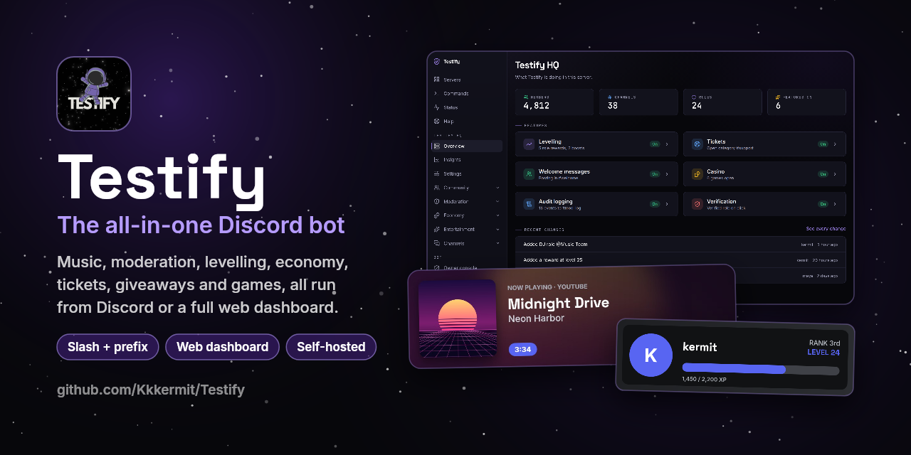

<p align="center">
  <a href="https://github.com/Kkkermit/Testify/actions/workflows/ci.yml"></a>
  <a href="package.json"></a>
  <a href="LICENSE"></a>
  <a href="https://github.com/Kkkermit/Testify/stargazers"></a>
</p>

<p align="center">
  <a href="https://www.typescriptlang.org"></a>
  <a href="https://discord.js.org"></a>
  <a href=".nvmrc"></a>
  <a href="https://discord.gg/xcMVwAVjSD"></a>
</p>

<h3 align="center">An all-in-one Discord bot, written once for both slash <em>and</em> prefix commands.</h3>

<p align="center">
<strong>79 commands and 131 subcommands</strong> — moderation, economy, a casino, levelling, music, tickets, giveaways
and games — plus an optional web dashboard. Every command works as <code>/ban</code> <strong>and</strong> as
<code>t?ban</code>, because underneath it is one command, not two copies.
</p>

<p align="center">
  <a href="#-quick-start"><strong>Quick start</strong></a> ·
  <a href="#-features"><strong>Features</strong></a> ·
  <a href="#-see-it-in-discord"><strong>Screenshots</strong></a> ·
  <a href="#️-the-web-dashboard"><strong>Dashboard</strong></a> ·
  <a href="docs/README.md"><strong>Docs</strong></a> ·
  <a href="https://discord.com/oauth2/authorize?client_id=1211784897627168778&permissions=8&scope=applications.commands%20bot"><strong>Invite it</strong></a>
</p>

> [!CAUTION]
> **Never share or commit your `.env` file.** It holds your bot token and your database password. `.gitignore`
> already covers it; if a token ever leaks, reset it in the Developer Portal straight away.

---

## 🧩 Features

- 🛡️ **Moderation** — ban, softban, kick, mute, lock and slowmode; warnings that escalate to a timeout, kick or ban;
  AutoMod; 18 audit-log events; tickets with HTML transcripts
- 💰 **Economy** — wallet and bank, work, daily, rob and heists, a shop, pets, a lottery, treasure drops and
  leaderboards for one server or every server
- 🎰 **Casino** — a shared roulette table, blackjack, hi-lo, slots, coinflip and dice, with the stake taken before
  anything is drawn, so a restart never swallows a bet
- 🎵 **Music** — YouTube and SoundCloud by link or search, one live panel, volume to 200%, DJ roles and a kill switch
- 📈 **Levelling** — XP, role rewards, boost roles and drawn rank cards
- 🎉 **Community** — giveaways, welcome cards, counting, sticky messages, auto roles, verification and live counters
- 🧰 **Everything else** — info and profiles, games, `/ask` (answers from written help articles, never generated
  text) and per-command switches for one server or the whole bot

**New in v2:** a complete TypeScript rewrite of the original JavaScript bot. One command now serves both surfaces
where there used to be 46 duplicated pairs, every setting goes through a validated `.env`, money moves atomically,
and nearly 6,000 tests guard an 80% coverage floor.

## 📸 See it in Discord

Every picture the bot sends is drawn on the fly with bundled fonts, so it looks the same on every host. These come
from its own renderers, redrawn with invented members by `npm run docs:images`.

<table>
<tr>
<td width="50%" align="center">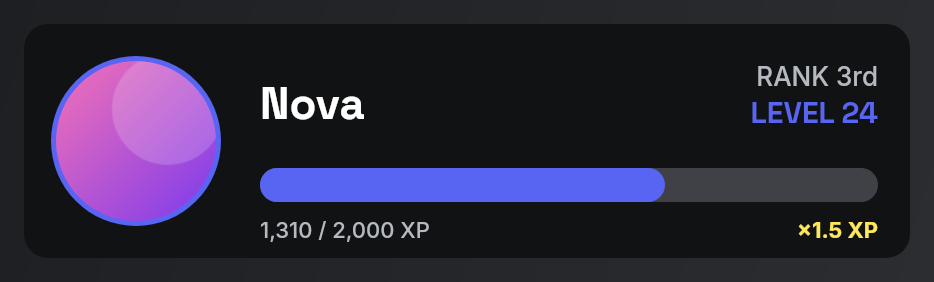<br><sub><b>/rank</b></sub></td>
<td width="50%" align="center">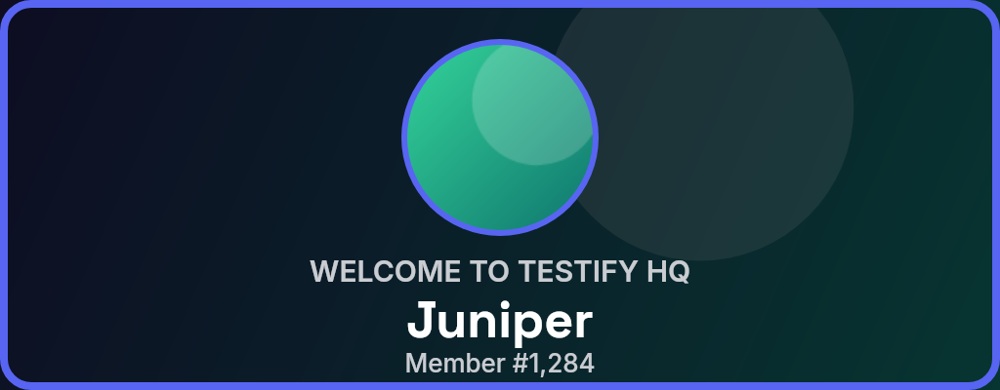<br><sub><b>Welcome card</b></sub></td>
</tr>
<tr>
<td align="center">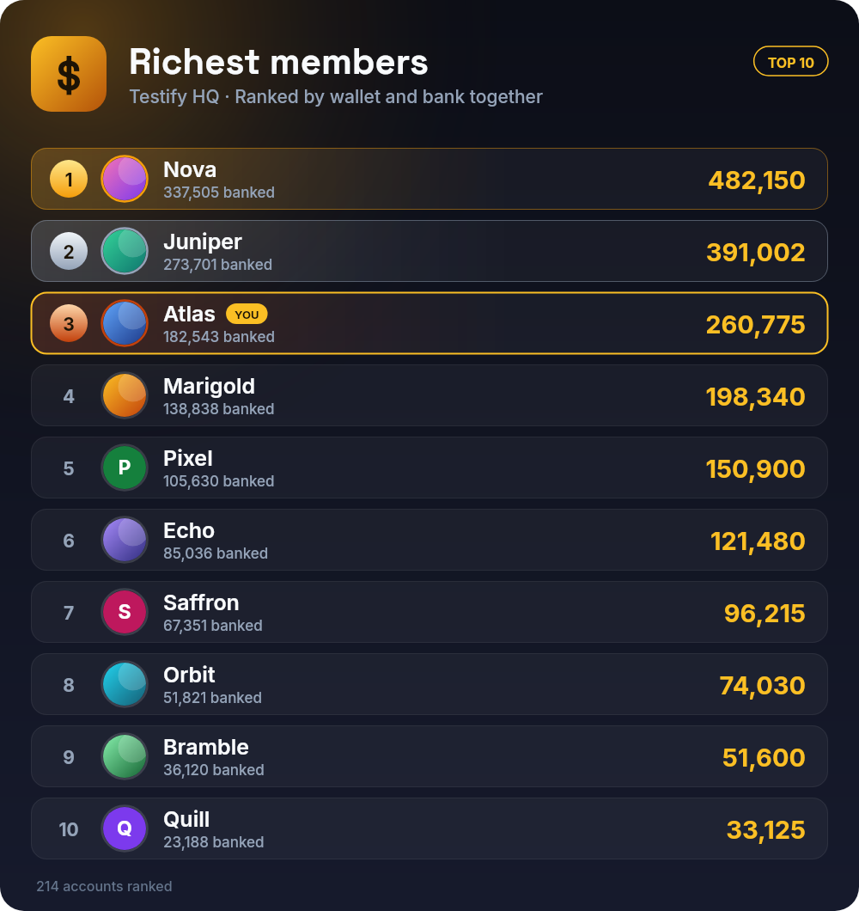<br><sub><b>/leaderboard</b> — your own row outlined</sub></td>
<td align="center">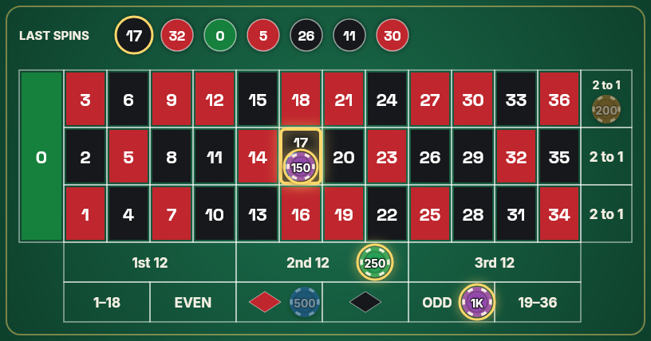<br><sub><b>Roulette</b> — everybody's chips in their own colour</sub><br><br>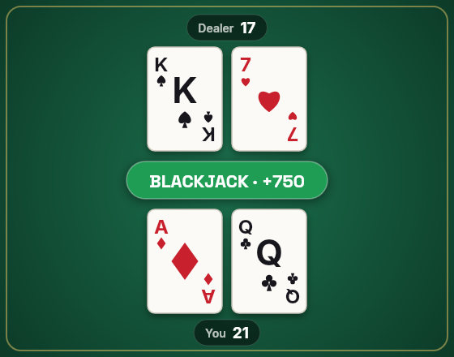<br><sub><b>Blackjack</b> — pays 3 to 2</sub></td>
</tr>
<tr>
<td colspan="2" align="center">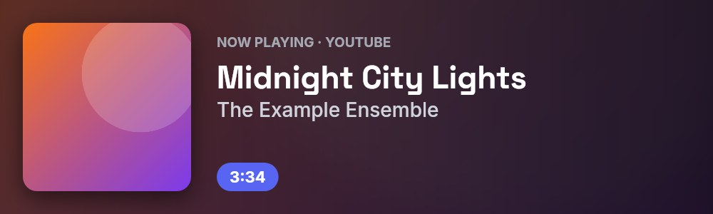<br><sub><b>Now playing</b> — on the music panel</sub></td>
</tr>
</table>

<sub>The wheel, hi-lo, slots and dice are in [`docs/images/bot/`](docs/images/bot).</sub>

## 🚀 Quick start

You need **Node 24.11 or newer** and a **MongoDB connection string** (the free Atlas tier is plenty). Windows,
macOS, Linux and a 64-bit Raspberry Pi all work.

```bash
git clone https://github.com/Kkkermit/Testify.git
cd Testify
npm ci                   # installs exactly what the lockfile says
npm run setup -- --dev   # asks for your token, client ID, owner ID and database URL
npm run dev              # starts the bot, restarting whenever you save a file
```

`npm run setup` checks each answer as you type it and writes the file for you. For the real bot rather than a
development one, run `npm run setup`, then `npm run build` and `npm start`.

<details>
<summary><strong>📖 First time? The full setup, step by step</strong></summary>

### 1. Create your bot

1. In the [Discord Developer Portal](https://discord.com/developers/applications), click **New Application**.
2. On the **Bot** tab, turn on **all three Privileged Gateway Intents** and save. Message Content is required —
   without it the bot cannot read a prefix command.
3. Click **Reset Token** and copy it. **This is the one value you must never share.**

### 2. Invite it

Under **OAuth2 → URL Generator**, tick `bot` and `applications.commands`, then **Administrator** while you are
getting started. Open the URL at the bottom and pick your server.

### 3. Get a database

1. Sign up at [MongoDB Atlas](https://www.mongodb.com/cloud/atlas/register) and create a **free M0 cluster**.
2. Under **Database Access**, create a user; under **Network Access**, allow access from anywhere.
3. Under **Connect → Drivers**, copy the connection string and put your password in place of `<password>`.

### 4. Fill in your settings

Run `npm run setup -- --dev`, or copy `.env.development.example` to `.env.development` and fill it in by hand.

| Variable               | Required | What it is                                                         |
| ---------------------- | :------: | ------------------------------------------------------------------ |
| `DISCORD_TOKEN`        |    ✅    | The token from step 1                                              |
| `DISCORD_CLIENT_ID`    |    ✅    | **General Information → Application ID**                           |
| `DISCORD_OWNER_IDS`    |    ✅    | Your Discord user ID; comma-separate for several owners            |
| `MONGODB_URI`          |    ✅    | The connection string from step 3                                  |
| `DISCORD_DEV_GUILD_ID` |    —     | A test server — commands register only there while you build       |
| `CHANNEL_*_LOG`        |    —     | Channels for errors, joins, DMs, commands, bug reports and `/eval` |
| `SUPPORT_AI_API_KEY`   |    —     | Lets `/ask` use Claude to pick the right help article              |

Every optional value can stay blank; that feature simply stays off. Each one is explained in `.env.example`.

> **Getting an ID:** turn on **Developer Mode** in Discord (Settings → Advanced), then right-click a user, server or
> channel and choose **Copy ID**.

### 5. Run it

`npm run dev` prints each start-up step as it finishes. If one fails, it stops there and says what to change — a
missing value, a rejected token, intents left off or an unreachable database — in a box rather than a stack trace.

### 6. Music

Usually nothing to do: FFmpeg and yt-dlp install themselves as optional dependencies. If `/music status` says one
is missing, run `npm run music:setup`. If YouTube answers _"Sign in to confirm you're not a bot"_, which is common
on cloud hosts, set `MUSIC_YTDLP_COOKIES` — `npm run music:cookies -- cookies.txt` turns an exported cookies file
into the one line Railway can take. Spotify links cannot be played by anything; search for the song instead.

> **Tip:** use two bot applications, one for development and one for production. `npm run dev` reads
> `.env.development`, so testing never touches your live bot or its database.

</details>

<details>
<summary><strong>💻 Compatibility</strong></summary>

| Platform                 | Notes                                                                                 |
| ------------------------ | ------------------------------------------------------------------------------------- |
| Windows 10 / 11          | `cross-env` sets the environment variables, so the scripts work in cmd and PowerShell |
| macOS                    | Apple Silicon and Intel                                                               |
| Linux                    | What CI runs on. Alpine needs `apk add python3 make g++` for the native modules       |
| Raspberry Pi             | A **64-bit** OS — the prebuilt canvas binaries are arm64 only                         |
| Node 24.11+              | What `.nvmrc` pins and CI tests. Older versions warn with `EBADENGINE`                |
| Vercel, Netlify, Workers | **Cannot** run it — a Discord bot holds a connection open for its whole life          |

</details>

## 🐳 Docker

```bash
cp .env.example .env     # fill it in, or run `npm run setup`
docker compose up -d
```

That brings up the bot and a MongoDB together, with FFmpeg and yt-dlp already in the image — on Railway too.
[`docs/hosting.md`](docs/hosting.md) covers the dashboard behind a proxy, what is in the image and troubleshooting.

## ⌨️ Slash and prefix

```text
/ban user:@someone reason:spamming
t?ban @someone spamming
```

The prefix is `t?` until a server changes it with `/prefix set`, and `/prefix disable` leaves slash commands only.
There are **90 prefix aliases** — `t?bal`, `t?lb`, `t?gamble` and the rest. A reply that would be private on a slash
command is deleted after 20 seconds on a prefix one, since a message cannot be private.

**The full list, with every subcommand, alias and permission, is [`docs/commands.md`](docs/commands.md)** — or run
`/help` in Discord.

<p align="center">
  <picture>
    <source media="(prefers-color-scheme: dark)" srcset="docs/images/diagrams/architecture-dark.png">
    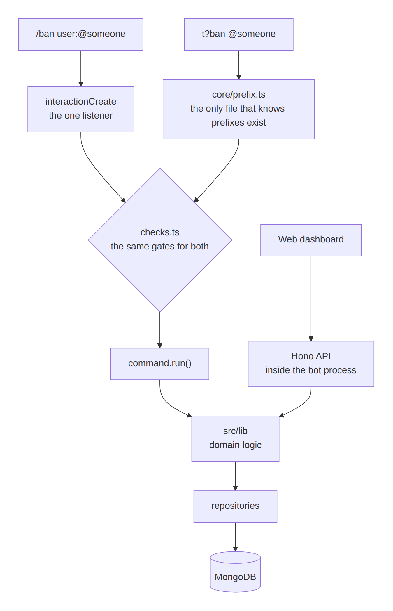
  </picture>
</p>

## 🛠️ Adding your own command

Create one file. The loader finds it, `/help` lists it, and it works as `/coinflip`, `t?coinflip`, `t?flip` and
`t?cf` straight away.

```ts
// src/commands/fun/coinflip.command.ts
import { defineCommand } from "@core/command";
import { reply, successEmbed } from "@lib/discord";

export default defineCommand({
	name: "coinflip",
	description: "Flips a coin.",
	category: "fun",
	aliases: ["flip", "cf"],
	async run(interaction) {
		const side = Math.random() < 0.5 ? "Heads" : "Tails";
		await reply(interaction, { embeds: [successEmbed(`🪙 ${side}!`)] });
	},
});
```

The `.command.ts` suffix is what the loader looks for, and `category` must exist in `src/config/categories.ts`.
Options, subcommands and buttons are in [`docs/contributing.md`](docs/contributing.md).

## 🖥️ The web dashboard

An optional dashboard with a screen for nearly everything the bot does — signed in with Discord and served **from
inside the bot**, so there is nothing else to deploy. It is **off by default**, follows your light or dark setting,
and speaks English, Spanish, German, French, Italian and Russian.

<p align="center">
  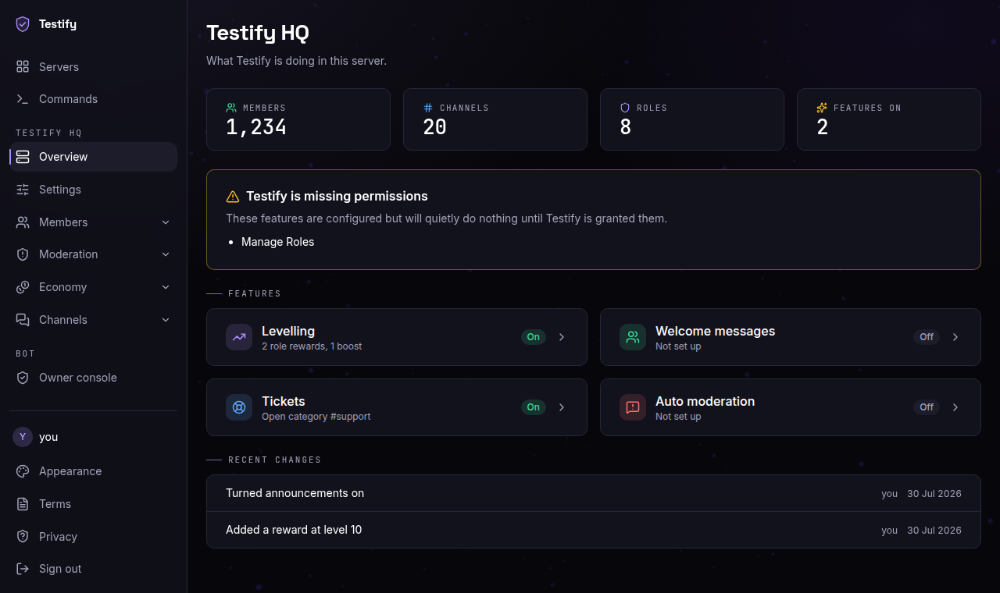
</p>

<table>
<tr>
<td width="50%">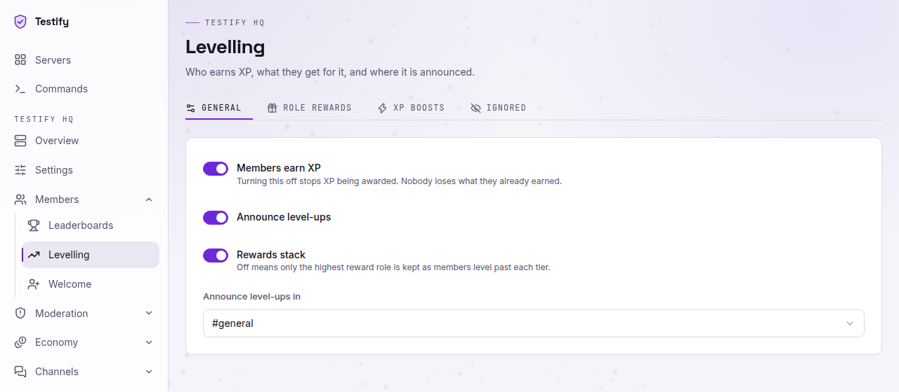<br><sub><b>Levelling</b>, in the light theme</sub></td>
<td width="50%">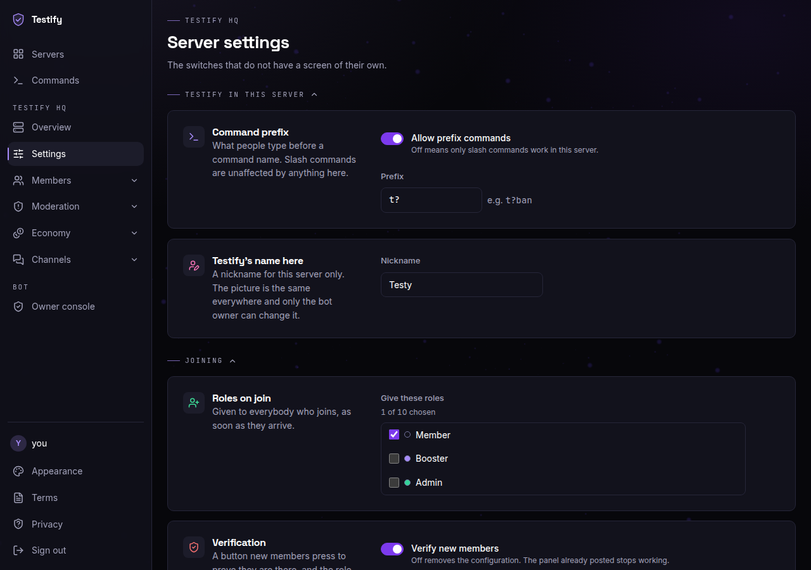<br><sub><b>Settings</b></sub></td>
</tr>
<tr>
<td valign="top">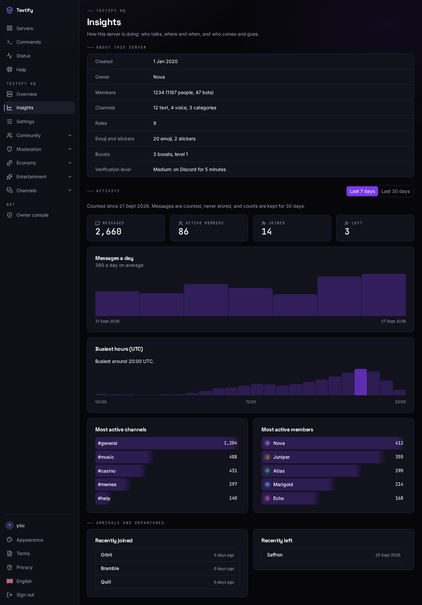<br><sub><b>Insights</b> — counted, no message text kept</sub></td>
<td valign="top">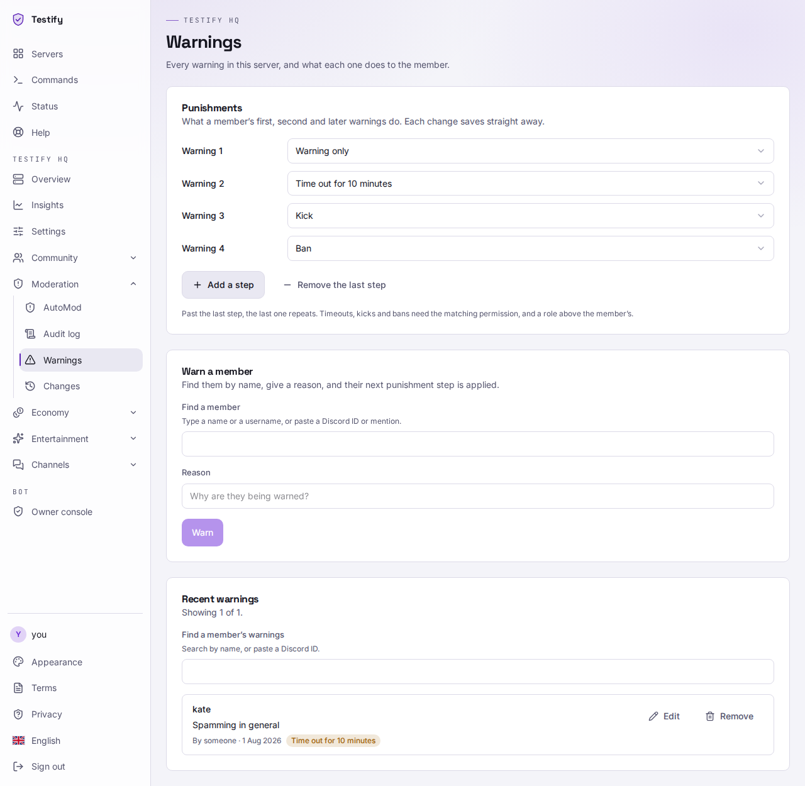<br><sub><b>Warnings</b> and their punishment steps</sub><br><br>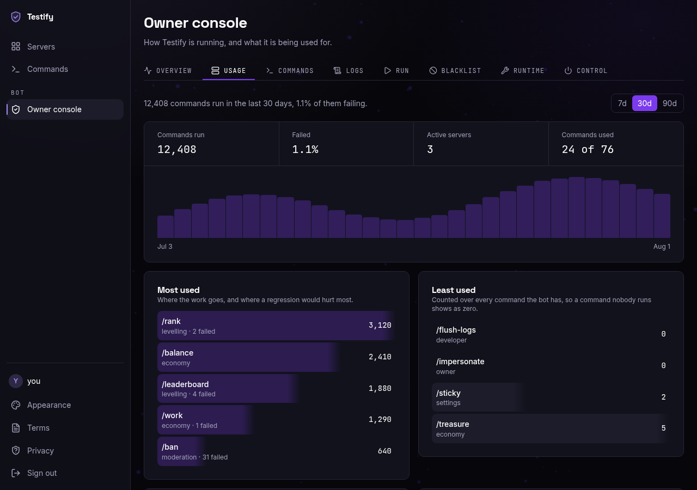<br><sub><b>Owner console</b> — only for the bot's owners</sub></td>
</tr>
</table>

<sub>Six more — servers, a member, status, casino, help and appearance — are in
[`docs/dashboard/screenshots/`](docs/dashboard/screenshots/README.md).</sub>

**Turning it on** takes four settings, and `npm run setup` fills in all of them and prints the redirect URL to paste
into Discord:

| Variable                   | What it is                                              |
| -------------------------- | ------------------------------------------------------- |
| `DASHBOARD_ENABLED`        | `true` to serve it at all                               |
| `DISCORD_CLIENT_SECRET`    | From the **OAuth2** tab of the same Discord application |
| `DASHBOARD_BASE_URL`       | Where people open it, e.g. `http://localhost:5174`      |
| `DASHBOARD_SESSION_SECRET` | `npm run secret -- --write` writes one into your `.env` |

Then `npm run dev:all` runs the bot and the dashboard together. Signing in shows only the servers you have
**Manage Server** in, checked against Discord on every request, and an action asks for what its command asks —
kicking from the web needs Kick Members. Before putting it on the internet, read
[`docs/security.md`](docs/security.md).

## 📜 Scripts

| Command                 | What it does                                                         |
| ----------------------- | -------------------------------------------------------------------- |
| `npm run dev`           | Runs the bot from source, restarting whenever you save               |
| `npm run dev:all`       | The bot and the web dashboard together                               |
| `npm run build`         | Compiles the bot and the dashboard                                   |
| `npm start`             | Runs the compiled bot                                                |
| `npm run setup`         | Interactive `.env` generator (add `-- --dev` for `.env.development`) |
| `npm run check`         | Typecheck, lint, format check and tests — everything CI runs         |
| `npm run commit`        | Guided commit message in the project's format                        |
| `npm run music:setup`   | Fetches yt-dlp, and reports whether FFmpeg is there                  |
| `npm run docs:commands` | Regenerates `docs/commands.md` from the real commands                |

Every script is listed in [`AGENTS.md` §3](AGENTS.md#3-running-testing-verifying).

## ❓ FAQ

<details>
<summary><strong>Does any of this cost money?</strong></summary>

No. Discord bots are free, and the free MongoDB Atlas tier is far more than enough. You only pay if you outgrow it
or host the bot somewhere other than your own machine.

</details>

<details>
<summary><strong>My slash commands are not showing up.</strong></summary>

Registration is immediate, but your Discord client caches the list — reload it with Ctrl+R (Cmd+R on macOS). If
that does not help, re-invite the bot with both `bot` and `applications.commands` ticked, and check the console
for a start-up failure. `npm run commands:clear` removes commands that no longer exist.

</details>

<details>
<summary><strong>Prefix commands are not working.</strong></summary>

Turn on **Message Content Intent** in the Developer Portal — without it the bot sees empty messages. Then check
`/prefix show`, and that `/prefix disable` has not been used.

</details>

<details>
<summary><strong>Do I need all three privileged intents?</strong></summary>

**Message Content** is required — prefix commands, automod, levelling and counting all read messages. **Server
Members** powers welcome messages, auto roles and counters. **Presence** is the one you can leave off.

</details>

<details>
<summary><strong>Can I switch off commands I do not want?</strong></summary>

Yes — from the dashboard's **Commands** screen for one server, or bot-wide from the owner console, with no code.
Or delete the command file: there is no registry to update.

</details>

<details>
<summary><strong>Where should I host it, and how do I update it?</strong></summary>

Anywhere that runs a long-lived process: a VPS, a Raspberry Pi, Railway, Fly.io, Render or a machine at home — not
a serverless host. To update, `git pull && npm ci && npm run build`; your `.env` and database are untouched.

</details>

<details>
<summary><strong>I leaked my token. What now?</strong></summary>

Reset it straight away under **Developer Portal → Bot → Reset Token** and update `.env`. Change a leaked MongoDB
password under **Atlas → Database Access**. Deleting the commit is not enough — anything pushed is public forever.

</details>

<details>
<summary><strong>Can I use this for my own bot, or rename it?</strong></summary>

Yes. Rename it in the Developer Portal and everything follows, since the bot reads its own name from Discord. It is
licensed under Apache 2.0 with the Commons Clause: keep the credit in [`NOTICE`](NOTICE), and do not sell it or a
service whose value comes mainly from it.

</details>

## 🩺 Troubleshooting

| Symptom                                          | Fix                                                                                  |
| ------------------------------------------------ | ------------------------------------------------------------------------------------ |
| `Your .env file needs attention`                 | The message names every value that is wrong. Optional ones can be blank              |
| `querySrv ECONNREFUSED`                          | Your DNS cannot resolve Atlas. Try another network, or the non-SRV connection string |
| `MongoServerError: bad auth`                     | Wrong database password, or `<password>` left in the connection string               |
| `Used disallowed intents`                        | Turn the privileged intents on in the Developer Portal                               |
| `Maximum number of application commands reached` | Over Discord's limit of 100 — group commands under a parent, as the error explains   |
| `EBADENGINE` during install                      | Your Node is older than 24.11. Run `nvm use`                                         |
| `Sign in to confirm you're not a bot`            | YouTube flagged the host. Set `MUSIC_YTDLP_COOKIES` (setup step 6)                   |

Still stuck? [Ask in Discord](https://discord.gg/xcMVwAVjSD) or [open an issue](https://github.com/Kkkermit/Testify/issues/new/choose).

## 📚 Documentation

| Document                                                | For                                                   |
| ------------------------------------------------------- | ----------------------------------------------------- |
| 📋 [`docs/commands.md`](docs/commands.md)               | Every command, subcommand, alias and permission       |
| 🐳 [`docs/hosting.md`](docs/hosting.md)                 | Docker, compose, Railway, and which hosts cannot work |
| 🤝 [`docs/contributing.md`](docs/contributing.md)       | Branches, commits and what CI checks                  |
| 🔒 [`docs/security.md`](docs/security.md)               | Reporting a vulnerability, and how data is handled    |
| 🖥️ [`docs/dashboard/guide.md`](docs/dashboard/guide.md) | Working on the web dashboard                          |
| 🧭 [`AGENTS.md`](AGENTS.md)                             | The conventions every change here follows             |

## 🤝 Contributing

Contributions are very welcome, including from first-timers. Branch from `develop` as `testify/<type>-<nn>`, run
`npm run check`, and open the pull request against `develop` — [`docs/contributing.md`](docs/contributing.md) has
the rest.

<p align="center">
  <a href="https://github.com/Kkkermit/Testify/graphs/contributors">
    
  </a>
</p>

## 💛 Support

Join the [Discord](https://discord.gg/xcMVwAVjSD) for help or just to say hello. If Testify is useful to you, a
⭐ or a [coffee](https://buymeacoffee.com/kkermit) keeps it going.

<div align="center">
 <a href="https://www.star-history.com/#Kkkermit/Testify&Date">
  <picture>
    <source media="(prefers-color-scheme: dark)" srcset="https://api.star-history.com/svg?repos=Kkkermit/Testify&type=Date&theme=dark" />
    
  </picture>
 </a>
</div>

## ⚖️ License

Copyright 2026 Kkermit ([Kkkermit](https://github.com/Kkkermit) on GitHub). Released under the
[Apache License 2.0](LICENSE) with the [Commons Clause](https://commonsclause.com) License Condition v1.0 — use,
modify and share it, but do not sell it, and keep the attribution in [`NOTICE`](NOTICE) in every copy.
