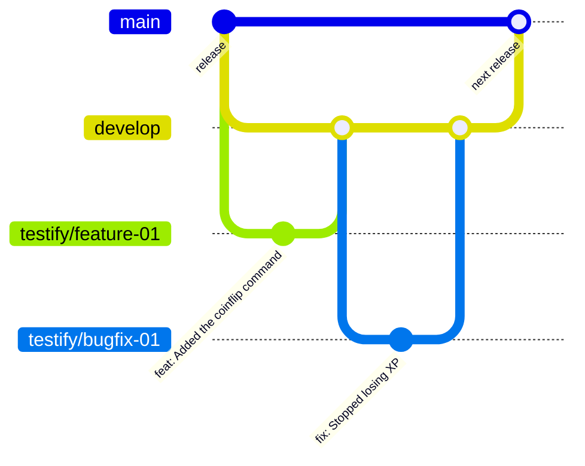

<div align="center">

# 🤝 Contributing to Testify

**Issues and pull requests are both welcome — including from first-timers.**

[](https://github.com/Kkkermit/Testify/pulls)
[](https://github.com/Kkkermit/Testify/tree/develop)
[](../.prettierrc)
[](../commitlint.config.mjs)

[Getting set up](#-getting-set-up) · [Branches](#-branches-and-releases) · [Before a PR](#-before-you-open-a-pull-request) ·
[House style](#-house-style) · [Commits](#-commits) · [Tests](#-tests)

</div>

> [!TIP]
> This page is the short version. [`AGENTS.md`](../AGENTS.md) is the full set of conventions every change follows —
> written for people and coding agents alike — and it wins wherever the two differ.

---

## 🚀 Getting set up

```bash
nvm use                  # Node 24.11 or newer, read from .nvmrc
npm ci                   # always ci, never install, unless you are changing dependencies
npm run setup -- --dev   # writes .env.development, the file `npm run dev` reads
npm run dev
```

You need a MongoDB you can connect to. Set `DISCORD_DEV_GUILD_ID` to a test server, so whatever you are halfway
through building is not live everywhere.

## 🌿 Branches and releases

`main` is the released code — what is deployed to the bot — and it is protected. `develop` is where work is
merged. Every few days a release pull request from `develop` into `main` ships what has gathered there.



Cut every piece of work from the latest `develop`, named `testify/<type>-<nn>`:

| Type      | For                                       | Example              |
| --------- | ----------------------------------------- | -------------------- |
| `feature` | A new feature, or a change to one         | `testify/feature-01` |
| `bugfix`  | A bug fix                                 | `testify/bugfix-01`  |
| `chore`   | Dependencies, CI, tooling and maintenance | `testify/chore-01`   |
| `docs`    | Documentation only                        | `testify/docs-01`    |

The number counts up per type — one past the highest used so far, counting merged pull requests as well as the
branches still on the remote. A merged branch is never reused; follow-up work takes the next number.

```bash
git fetch origin develop
git checkout -b testify/feature-02 origin/develop
```

> [!IMPORTANT]
> **Open pull requests against `develop`, never `main`.** Only the release pull request goes into `main`.

## ✅ Before you open a pull request

```bash
npm run check
```

That runs the typecheck, the linter, the formatter check and the tests — exactly what CI runs. The git hooks run
most of it for you, and the pre-push hook also enforces the coverage floor.

- [ ] `npm run check` passes
- [ ] New logic has a test, and a new enforcement test has been seen to fail
- [ ] `npm run docs:commands` re-run if a command, option or alias changed
- [ ] Documentation updated if behaviour changed
- [ ] The branch is cut from `develop`, and the pull request targets `develop`

**Changed the loader, a file name or the build?** `npm run check` cannot see a broken glob — it compiles, passes
every test and registers nothing. Run the loader smoke test in [`AGENTS.md` §3](../AGENTS.md#3-running-testing-verifying)
as well.

## 🎨 House style

- **No comments that restate the code.** Write one when the _why_ is not obvious from the _what_ — an ordering
  constraint, a Discord API quirk, a decision that looks wrong until you know the reason. One sentence.
- **Formatting is Prettier's job.** Tabs, 120 columns; do not fight it by hand.
- **British spelling** in user-facing text and in names we own (`colour`, `levelling`). discord.js spellings stay
  as discord.js writes them.
- **Throw, do not reply, on failure.** `UserFacingError` is shown to the user; anything else is logged and they get
  a generic apology with a reference.
- **Build embeds with `embed()`** from `@lib/discord` so everything matches. The linter enforces this.
- **Answer with `reply()`**, never `interaction.reply` directly — it picks reply, edit or follow-up for you.

## 🗺️ Where things go

| You are adding…            | Put it in                                     |
| -------------------------- | --------------------------------------------- |
| A command                  | `src/commands/<category>/<name>.command.ts`   |
| A button, menu or modal    | `src/buttons/`                                |
| A gateway event            | `src/events/<group>/<name>.event.ts`          |
| Something on every message | `src/events/message/`                         |
| Repeating background work  | `src/jobs/`                                   |
| A shared helper            | `src/lib/<domain>/<name>.util.ts`             |
| A database model or query  | `src/database/models/` and `…/repositories/`  |
| A dashboard screen         | The six edits in the [dashboard guide][guide] |
| A help article for `/ask`  | `assets/support/<id>.md`                      |

[guide]: dashboard/guide.md#7-adding-a-screen--the-six-edits

Nothing needs registering — the loader picks files up from these folders at start-up. If a file is shaped wrongly
the bot refuses to start and names it. **The suffix is load-bearing:** a command without `.command.ts` is silently
never loaded, which is why a test enforces it.

## 📦 Imports

Modules are imported by alias, never by a relative path that climbs:

```ts
import { theme } from "@config/theme";
import { embed } from "@lib/discord";
import { type CommandInput } from "@core/command";
```

The map lives in `tsconfig.json` and nowhere else — `jest.config.ts` reads it, and the build rewrites the aliases
to relative paths with `tsc-alias` so `dist/` runs under plain Node. Adding an alias means editing one file.

`src/lib` is split into domain folders — `discord`, `music`, `economy` and so on — each behind an `index.ts`
barrel:

|                                                      | Imports                                          |
| ---------------------------------------------------- | ------------------------------------------------ |
| Commands, buttons, events, API routes and jobs       | The barrel — `@lib/music`                        |
| Code inside `src/lib`, `src/core` and `src/database` | The module itself — `@lib/music/musicQueue.util` |
| Tests                                                | The module under test, by its own path           |

A barrel inside the layers it is built from is how a cycle starts, so the linter enforces both rules. A new module
needs one line in its folder's `index.ts`, and a test names it if that line is missing.

## ⌨️ Slash and prefix

Commands are written once, against the `CommandInput` contract in `src/core/command.ts`. A slash interaction
satisfies it, and so does `PrefixInteraction` in `src/core/prefix.ts` — the only file in the codebase that knows
prefix commands exist.

If you add something to `CommandInput`, the compiler will make you teach the prefix side to answer it too. That is
deliberate: it is what stops the two surfaces drifting apart.

Two things to keep in mind when adding options:

- **Required options come first.** Prefix commands fill options by position, and Discord rejects a slash command
  that lists a required option after an optional one. A test enforces this.
- **Put the free-text option last.** The final text option swallows the rest of the message, so
  `t?ban @someone being a nuisance` works without quotes.

## 💯 Discord's limit of 100 commands

An application may publish 100 slash commands, and Discord rejects the whole batch if you go over — so one command
too many stops the bot starting. There is a test for it, and start-up refuses with an explanation.

Subcommands do not count, so the way to add more is to group. Move the file into a `subcommands/` folder — the
loader only reads files directly inside a category folder — and expose it from a parent:

```ts
// src/commands/fun/fun.command.ts
import { asSubcommand, defineCommand } from "@core/command";
import dadJoke from "@commands/fun/subcommands/dadJoke.command";

export default defineCommand({
	name: "fun",
	description: "Jokes, generators and other nonsense.",
	category: "fun",
	subcommands: [asSubcommand(dadJoke, ["dadjoke"])],
});
```

`subcommands/dadJoke.command.ts` stays an ordinary command file — nothing inside it changes. It keeps its own name
as a prefix alias, so `t?dad-joke` still works alongside `/fun dad-joke`, and the second argument adds more.

## 🌍 Translating the dashboard

Every string the dashboard renders lives in `dashboard/src/i18n/locales/`. English is the source, and Spanish,
German, French, Italian and Russian are translated from it.

- **To add a language,** copy `en.json`, translate the values, and add the code and its endonym — the word the
  language calls itself — to `LOCALES` and `LOCALE_NAMES` in `dashboard/src/i18n/index.ts`.
- **To fix a wording,** edit `en.json` and the five files beside it.

The tests name anything missed: a key English has that yours does not, a stale key left by a rename, or a changed
`{{placeholder}}`. `dashboard/src/test/voice.test.ts` holds the house style — British spelling, curly apostrophes,
second person — and reads the dictionary directly.

The bot's own replies inside Discord are **not** translated, and neither is anything a server has typed itself.

## 🧪 Tests

Tests live in `tests/` and mirror `src/`; the dashboard's sit beside its code. Anything with real logic in it —
formatting, pagination, the levelling curve, a repository, a panel renderer — should have one.

- **Test the pure renderer, not the handler.** That is why every panel is split into a renderer and a button
  handler.
- **Name the behaviour,** not the implementation: `"disables Use on an item that cannot be used"`.
- **A test must be able to fail.** If you add one that enforces a rule, break the rule once and watch it go red.
- **Repository tests use an in-memory MongoDB.** Without one they report as _skipped_, never as passed — and CI
  sets `REQUIRE_DB_TESTS=1`, so a runner that cannot start a database fails rather than going quietly green.

The coverage floor is **80%** of statements, lines, functions and branches, checked by `npm run test:coverage` and
by the pre-push hook.

## 📝 Commits

`type: Capitalized subject` — no scopes, no bodies, no trailers. A `commit-msg` hook runs commitlint, so the
convention holds whether or not you remember it.

```text
feat: Added the coinflip command
fix: Stopped losing XP when two messages arrive together
```

| Type       | Meaning                            | Type     | Meaning                             |
| ---------- | ---------------------------------- | -------- | ----------------------------------- |
| `feat`     | A new feature                      | `test`   | Adding or updating tests            |
| `fix`      | A bug fix                          | `chore`  | Maintenance, dependency updates     |
| `docs`     | Documentation changes              | `add`    | Adding new features or files        |
| `style`    | Code style (formatting, etc)       | `update` | Updating existing features or files |
| `refactor` | Refactoring with no feature change | `remove` | Removing features or files          |
| `perf`     | Performance improvements           |          |                                     |

`npm run commit` walks you through it.

## 🪝 Hooks

| Hook         | Runs                          | Why                                                              |
| ------------ | ----------------------------- | ---------------------------------------------------------------- |
| `pre-commit` | `typecheck`, then lint-staged | Staged-only linting cannot see a type error in an unstaged file  |
| `commit-msg` | `commitlint`                  | The commit format holds without relying on people remembering it |
| `pre-push`   | `lint`, `test:coverage`       | Coverage thresholds gate the push, not just CI                   |

## 🐛 Reporting a bug or asking for a feature

Open an issue from the [templates](https://github.com/Kkkermit/Testify/issues/new/choose) — they ask for what is
needed to act on it. For setup help, the [support server](https://discord.gg/xcMVwAVjSD) is quicker.

> [!WARNING]
> **Never report a security problem in a public issue.** See [`security.md`](security.md) for the private route.

Everybody here is held to the [code of conduct](code-of-conduct.md).
