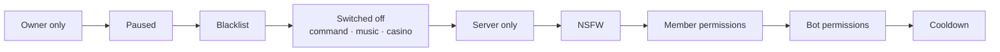

# 🔒 Security policy

**How to report a vulnerability, and how Testify handles what it is trusted with.**

[Reporting](#-reporting-a-vulnerability) · [Scope](#-scope) · [Data](#️-what-the-bot-does-with-sensitive-data) ·
[Dashboard](#️-the-web-dashboard) · [Self-hosting](#️-self-hosting-checklist) · [Dependencies](#-dependency-scanning)

---

## 📮 Reporting a vulnerability

> [!CAUTION]
> **Please do not open a public issue for a security problem.** A public report is a public exploit until it is
> fixed.

Report it through GitHub's **[private vulnerability reporting](https://github.com/Kkkermit/Testify/security/advisories/new)**
on this repository, or to the maintainer directly on [Discord](https://discord.gg/xcMVwAVjSD). Include:

1. **What you found** — the component, route or command.
2. **How to reproduce it** — the smallest steps that show it.
3. **What an attacker could do with it** — read, change, escalate, or take down.

You can expect a first response within a few days. Fixes land on `develop` and ship to `main` in the next release —
sooner, in a release of their own, when the problem is serious.

## 🗓️ Supported versions

| Version | Supported | Notes                                       |
| ------- | :-------: | ------------------------------------------- |
| 2.x     |    ✅     | The TypeScript rewrite. Every fix goes here |
| 1.x     |    ❌     | The original JavaScript bot. No longer kept |

## 🎯 Scope

| In scope                                                                   | Out of scope                                                    |
| -------------------------------------------------------------------------- | --------------------------------------------------------------- |
| Anything in this repository: the bot, the dashboard API and the SPA        | Discord itself, MongoDB Atlas, or any other outside service     |
| Reaching another server's data, or acting beyond your Discord permissions  | A self-hoster who exposed their own `.env` or ran as root       |
| Reaching the owner console or `/eval` without being in `DISCORD_OWNER_IDS` | Denial of service by sheer volume against somebody's own host   |
| Leaking a token, secret, session or anybody's personal data                | Social engineering of maintainers or users                      |
| A dependency advisory that is actually reachable from the running code     | An advisory reachable only from build tooling, already excepted |

## 🗝️ What the bot does with sensitive data

| What                   | How it is handled                                                                                                                                                                                                                 |
| ---------------------- | --------------------------------------------------------------------------------------------------------------------------------------------------------------------------------------------------------------------------------- |
| **Bot credentials**    | Read once from the environment by `src/config/env.ts`, validated, and never written to the database or the logs. `/eval` output redacts every environment value whose name looks like a secret.                                   |
| **Dashboard sessions** | The Discord OAuth tokens a session holds are encrypted at rest with **AES-256-GCM**, under a key derived by **HKDF** from `DASHBOARD_SESSION_SECRET`. Rotating that secret signs everybody out — the intended response to a leak. |
| **Signing in**         | A random `state` and a **PKCE (S256)** verifier ride in an HttpOnly cookie that lasts ten minutes, and the state is compared in constant time, so a crafted callback cannot bind somebody else's Discord account.                 |
| **Message activity**   | Insights count messages per channel, member and hour — **the text is never read or stored**, and counts expire after 30 days.                                                                                                     |
| **Command usage**      | Counted per command, server and day, with **no user IDs**. Dashboard screen views are counted per route, with no server or user ID either.                                                                                        |
| **`/ask` questions**   | Never logged or stored. Answers are written help articles, so no model output reaches a reader, and every answer is checked for secrets on the way out.                                                                           |
| **Verification codes** | Short-lived; MongoDB evicts a pending code after fifteen minutes.                                                                                                                                                                 |
| **IP addresses**       | Not stored, and nothing records a location, device or browser.                                                                                                                                                                    |

### Every command passes the same gates

Slash and prefix commands run through one chain in `src/core/checks.ts`, in this order, before any command code
runs:

**Owner-only commands refuse everybody else first, and say so.** An attempt is logged and posted to the eval log
channel. `/eval` checks ownership a second time inside the command, runs in a separate VM context with a
five-second limit on synchronous code, posts every run with its full code, and is never reachable from the
dashboard.

## 🖥️ The web dashboard

The dashboard is **off by default**. Turned on, it is guarded in layers, each with a test that was seen to fail:

| Layer                       | What it does                                                                                                               |
| --------------------------- | -------------------------------------------------------------------------------------------------------------------------- |
| **Content Security Policy** | `script-src` has no `'unsafe-inline'` or `'unsafe-eval'`, plus `frame-ancestors 'none'`, `nosniff`, `no-referrer` and HSTS |
| **CSRF**                    | A double-submit token on every write, compared with `timingSafeEqual`                                                      |
| **Validation**              | Every parameter, query and body goes through zod; nothing reads raw input                                                  |
| **Server access**           | Manage Server is checked against Discord **live, on every request**, so losing it locks you out on your next click         |
| **Reach**                   | An action asks what its command asks — Kick Members to kick — and every channel and role named must belong to that server  |
| **Owner console**           | Answers **404** to anybody not in `DISCORD_OWNER_IDS`, and its code is only ever served to an owner's session              |
| **Rate limiting**           | A bounded fixed window per session, falling back to the address                                                            |
| **Cookies**                 | Set in one place, always `HttpOnly` and `SameSite=Lax`, and `Secure` outside development                                   |

The full model, and the rules that are easy to break silently, are in [`AGENTS.md` §24](../AGENTS.md#24-the-dashboard).

## 🛠️ Self-hosting checklist

- [ ] **Give the bot only the permissions it needs.** It checks its own permissions before acting and reports what
      is missing.
- [ ] **Keep `DISCORD_OWNER_IDS` to accounts you control.** Owner commands include `/eval`.
- [ ] **Leave `DASHBOARD_BIND` at `127.0.0.1`** unless a reverse proxy with HTTPS is in front of it.
- [ ] **Set `DASHBOARD_TRUST_PROXY=true` only behind a proxy you control** — trusting `x-forwarded-for` without one
      lets anyone forge their rate-limit bucket.
- [ ] **Use `https://` in `DASHBOARD_BASE_URL`** once you have a certificate.
- [ ] **Never commit `.env`.** If a token leaks, reset it in the Developer Portal straight away; deleting the commit
      is not enough.
- [ ] **Treat a `MUSIC_YTDLP_COOKIES` value as a password.** It is a signed-in session.

## 🔍 Dependency scanning

| When              | What runs                                                          | On failure                           |
| ----------------- | ------------------------------------------------------------------ | ------------------------------------ |
| Every push and PR | `npm run audit` — `better-npm-audit` at **high**, reading `.nsprc` | The build fails                      |
| Every night       | The tests again, `npm run audit`, and **Snyk** reading `.snyk`     | An issue labelled `ci-failure` opens |

Snyk is `continue-on-error`, so a quota or permission hiccup on Snyk's side cannot fail the pipeline, and it is
skipped with a notice while the `SNYK_TOKEN` secret is unset.

### Suppressions expire

`.nsprc` (npm audit) and `.snyk` hold anything deliberately not acted on. Every entry needs three things, and an
entry missing any of them should be removed:

1. **Why** it cannot be fixed now.
2. **The version that fixes it**, so there is something to wait for — or, when no release fixes it yet, the words
   `no fixed release yet`, and an expiry within 90 days instead of a year.
3. **A hard expiry**, so the suppression cannot rot into a permanent blind spot.

`tests/config/suppressions.test.ts` reads both files and fails on an entry missing any of the three.

| Advisory                                                                 | Package      | Reached through                                 | Why it is safe                                                                                                                   | Expires        |
| ------------------------------------------------------------------------ | ------------ | ----------------------------------------------- | -------------------------------------------------------------------------------------------------------------------------------- | -------------- |
| [GHSA-ggr8-5vv4-36mx](https://github.com/advisories/GHSA-ggr8-5vv4-36mx) | deepmerge-ts | discord-giveaways, whose latest release pins v4 | Nothing here merges an object graph somebody else supplied. Excepted in both files, and in `.snyk` on that one path only         | 20 March 2027  |
| [GHSA-vfj7-8cjw-p6xm](https://github.com/advisories/GHSA-vfj7-8cjw-p6xm) | braces       | tsc-alias, at build time only                   | Not in the production tree, and the patterns it expands come from this repository's own `tsconfig.json`. No release fixes it yet | 1 January 2027 |

### Version pins

`overrides` in `package.json` pins transitive dependencies. npm does not allow comments there, so the reasons live
here. Each one should be dropped the moment its parent updates — check when a dependency bump lands.

| Pin                                                | Why                                                                                                                                                                         |
| -------------------------------------------------- | --------------------------------------------------------------------------------------------------------------------------------------------------------------------------- |
| `glob: $glob`                                      | Several transitive dependencies still ask for glob v7, which warns on install. Pinned to the version this project already uses.                                             |
| `test-exclude: ^7.0.1`                             | Reached through jest's coverage reporter; older releases depend on the deprecated glob v7.                                                                                  |
| `esbuild: ^0.28.1`                                 | tsup ships an older esbuild than the one with GHSA-67mh-4wv8-2f99 fixed.                                                                                                    |
| `serialize-javascript: ^7.0.7`                     | Reached through jest-worker; older releases carry a prototype-pollution advisory.                                                                                           |
| `brace-expansion: ^5.0.12`                         | Reached through minimatch, which glob, ESLint and jest all load and which asks for `^5.0.8`. 5.0.12 fixes GHSA-qhr7-859c-m2p7, GHSA-6j4f-fj2g-mc7p and GHSA-q2hr-2g5m-vwhr. |
| `fast-uri: ^3.1.5`                                 | Reached through better-npm-audit → table → ajv. 3.1.5 fixes GHSA-7p8r-x3mc-p8w7; ajv asks for `^3.0.1`.                                                                     |
| `js-yaml: ^4.3.2`                                  | Reached through commitlint → cosmiconfig. 4.3.1 fixes GHSA-5p4m-2wfm-xmqj, which the advisory's range ends before.                                                          |
| `@istanbuljs/load-nyc-config` → `js-yaml: ^3.15.1` | The same advisory on the 3.x line, reached through jest's coverage plugin. Scoped, because 3.x and 4.x have different APIs.                                                 |
| `discord-html-transcripts` → `undici`              | The package pins undici v5, which has open advisories. v6 is API-compatible, and `^6.28.1` fixes GHSA-rfgv-xxqx-mfg5.                                                       |
